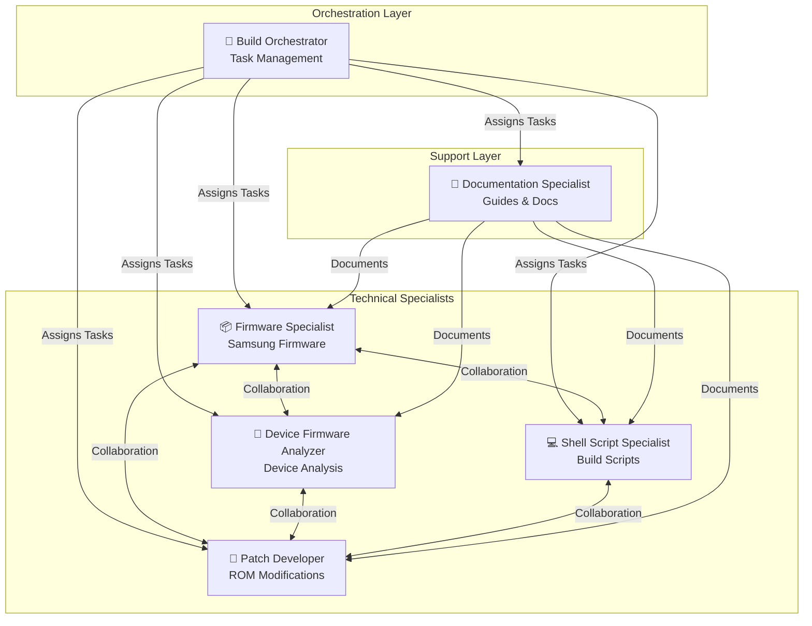

# UN1CA GitHub Copilot Custom Agent Profiles

This directory contains **6 specialized custom agent profiles** that enable domain-specific assistance from GitHub Copilot for the UN1CA custom firmware project. Each profile provides deep expertise in specific areas of Android custom ROM development, from firmware handling to patch development.

**Quick Navigation:**
- [🔧 Build Orchestrator](#-build-orchestrator) - Main coordinator and task manager
- [📦 Firmware Specialist](#-firmware-specialist) - Samsung firmware expert
- [📱 Device Firmware Analyzer](#-device-firmware-analyzer) - Device configuration and analysis expert
- [💻 Shell Script Specialist](#-shell-script-specialist) - Bash scripting master
- [🔨 Patch Developer](#-patch-developer) - Android patching expert
- [📝 Documentation Specialist](#-documentation-specialist) - Technical writing expert

## Agent Profile Format

Each agent profile is a Markdown file with YAML frontmatter that specifies:
- **name**: Unique identifier for the agent (kebab-case)
- **description**: Brief explanation of the agent's capabilities and expertise
- **tools**: List of tools the agent can use (all agents have full access: `["*"]`)

The YAML frontmatter is followed by the agent's instructions in Markdown format, which define behavior, expertise, and guidelines.

## 🚀 UN1CA Custom Agent Ecosystem

### What is UN1CA?

UN1CA is a custom firmware for Samsung Galaxy devices based on One UI, designed to provide an optimized, debloated, and enhanced experience. The build system automates:
- Downloading and extracting Samsung firmware
- Applying system patches and modifications
- Building flashable ROM packages
- Managing device-specific customizations

### Agent Ecosystem Architecture



## 🤖 Available Agent Profiles

### 🔧 Build Orchestrator (`build-orchestrator.md`)
**Role**: Main Coordinator & Task Manager  
**Focus**: Comprehensive Analysis, Issue Creation, Agent Assignment

The Build Orchestrator is your central intelligence for the UN1CA project, analyzing the build system from all angles and creating actionable tasks for specialist agents.

**Core Expertise:**
- 🔍 Build system analysis and optimization
- 📊 Issue identification and prioritization
- 🎯 Intelligent agent assignment
- 📝 GitHub issue creation with comprehensive context
- 🏗️ Build pipeline orchestration

**Key Capabilities:**
- Deep repository and code analysis
- Build system workflow understanding
- Performance bottleneck identification
- Security and quality assessment
- Task creation and distribution

**Use Cases:**
- "Analyze the build system and create improvement issues"
- "Review recent changes and identify potential problems"
- "Optimize the build pipeline performance"
- "Create tasks for the next development sprint"

---

### 📦 Firmware Specialist (`firmware-specialist.md`)
**Role**: Samsung Firmware Expert  
**Focus**: Firmware Download, Extraction, Partition Handling

The Firmware Specialist deeply understands Samsung firmware structure, Odin packages, and partition systems.

**Core Expertise:**
- 📥 Firmware download and verification (samloader)
- 📦 Odin package extraction (BL, AP, CP, CSC)
- 💿 Partition image handling (super.img, EROFS, ext4, f2fs)
- 🔐 AVB (Android Verified Boot) and vbmeta
- 📋 Metadata extraction (fs_config, file_context)

**Key Capabilities:**
- Optimizing firmware download and extraction
- Handling new firmware formats
- Partition unpacking and repacking
- Image building with various filesystems
- Firmware verification and integrity checks

**Use Cases:**
- "Optimize firmware extraction performance"
- "Add support for new firmware compression format"
- "Improve partition metadata extraction"
- "Handle EROFS to ext4 conversion"

---

### 📱 Device Firmware Analyzer (`device-firmware-analyzer.md`)
**Role**: Device Configuration and Analysis Expert  
**Focus**: Device-Specific Firmware Analysis, Hardware Features, Configuration Optimization

The Device Firmware Analyzer specializes in analyzing Samsung device configurations, hardware capabilities, and firmware variations across different device models and regions.

**Core Expertise:**
- 📱 Device configuration analysis (config.sh files)
- 🔍 SEC Product Feature identification and mapping
- 🏗️ Hardware capability assessment
- 🌍 Regional firmware variation analysis
- ⚡ Performance optimization opportunities
- 📊 Device comparison and compatibility analysis

**Key Capabilities:**
- Analyzing device-specific configurations
- Extracting and documenting hardware features
- Comparing device variants and regional differences
- Identifying optimization opportunities
- Supporting new device addition
- Validating firmware compatibility

**Use Cases:**
- "Analyze configuration for Galaxy A52s and suggest optimizations"
- "Compare hardware features between a52sxq and a73xq"
- "Extract SEC Product Features from new device firmware"
- "Validate config.sh for new device support"
- "Identify regional firmware differences"

---

### 💻 Shell Script Specialist (`shell-script-specialist.md`)
**Role**: Bash Scripting Master  
**Focus**: Script Quality, Best Practices, Error Handling

The Shell Script Specialist ensures all build scripts are robust, maintainable, and follow best practices.

**Core Expertise:**
- ✅ shellcheck compliance and best practices
- 🔧 Error handling and recovery mechanisms
- 📝 Logging and debugging support
- 🎯 Performance optimization
- 🏗️ Code modularity and reusability

**Key Capabilities:**
- Fixing shellcheck warnings and errors
- Implementing robust error handling
- Optimizing script performance
- Improving code maintainability
- Creating reusable utility functions

**Use Cases:**
- "Fix shellcheck issues in build scripts"
- "Improve error handling in make_rom.sh"
- "Optimize script performance with parallel processing"
- "Refactor common patterns into utility functions"

---

### 🔨 Patch Developer (`patch-developer.md`)
**Role**: Android Patching Expert  
**Focus**: Smali Modifications, APK/JAR Patching, Module System

The Patch Developer specializes in Android system customization through smali code manipulation and APK modifications.

**Core Expertise:**
- 🔍 Smali/baksmali mastery
- 📦 APK/JAR decompilation and rebuilding (apktool)
- 🔨 UN1CA module system (patches and mods)
- 🎨 Framework and SystemUI modifications
- 🔧 Feature enablement and customization

**Key Capabilities:**
- Creating and maintaining patches
- Smali code injection and modification
- Module system development
- Compatibility management across devices
- APK resource modification

**Use Cases:**
- "Create patch to enable hidden Samsung feature"
- "Fix smali syntax error in SystemUI patch"
- "Develop new mod for boot animation"
- "Ensure patch compatibility across Android versions"

---

### 📝 Documentation Specialist (`documentation-specialist.md`)
**Role**: Technical Writing Expert  
**Focus**: Guides, API Documentation, User Instructions

The Documentation Specialist creates clear, comprehensive, and user-friendly documentation for all aspects of UN1CA.

**Core Expertise:**
- 📖 User guides and tutorials
- 👨‍💻 Developer documentation
- 📚 API and script reference documentation
- 🔧 Installation and setup instructions
- ❓ Troubleshooting guides and FAQs

**Key Capabilities:**
- Writing clear technical documentation
- Creating step-by-step guides
- Documenting code and APIs
- Visual documentation with diagrams
- Maintaining documentation accuracy

**Use Cases:**
- "Create build guide for new users"
- "Document module development API"
- "Write troubleshooting guide for common issues"
- "Update README with new features"

---

## 🔄 Agent Collaboration Patterns

### Pattern 1: Analysis → Task Creation → Execution
```
Build Orchestrator (analysis) 
    → Create Issues
    → Assign to Specialists
    → Review Completion
```
**Use for**: Regular project improvements, bug fixes, optimizations

### Pattern 2: Cross-Functional Development
```
Firmware Specialist + Shell Script Specialist + Patch Developer
    → Working together on complex features
```
**Use for**: Major features requiring multiple expertise areas

### Pattern 3: Documentation Pipeline
```
Specialist Agent (implements change)
    → Documentation Specialist (documents change)
    → Build Orchestrator (verifies completeness)
```
**Use for**: Ensuring all changes are properly documented

### Pattern 4: Quality Assurance
```
Shell Script Specialist (code quality)
    → Patch Developer (functionality)
    → Documentation Specialist (documentation)
    → Build Orchestrator (integration)
```
**Use for**: Comprehensive quality improvements

## How to Use These Profiles

These custom agent profiles are designed to be used with GitHub Copilot's coding agent to provide specialized, context-aware assistance.

### Invoking an Agent

1. Open the GitHub Copilot chat
2. Type `@` and select the agent from the dropdown
3. Describe your task or question
4. The agent will respond with specialized expertise

### Example Interactions

```
@build-orchestrator Analyze the build system and create improvement issues

@firmware-specialist Optimize the firmware extraction process in extract_fw.sh

@shell-script-specialist Fix shellcheck warnings in scripts/utils/build_utils.sh

@patch-developer Create a patch to enable outdoor mode on all devices

@documentation-specialist Write a comprehensive build guide for new contributors
```

## UN1CA Project Context

### About UN1CA
- **Custom firmware for Samsung Galaxy devices**
- **Based on One UI** with optimizations and enhancements
- **Automated build system** for firmware customization
- **Supported devices**: Galaxy A52s, A73, M52 (and more)

### Build Process Overview
1. **Environment Setup** - Initialize build environment
2. **Firmware Download** - Download Samsung firmware packages
3. **Firmware Extraction** - Extract firmware partitions and metadata
4. **Workspace Creation** - Set up build workspace
5. **Patch Application** - Apply device-specific and ROM patches
6. **Mod Application** - Apply optional modifications
7. **APK Building** - Rebuild modified APKs and JARs
8. **Image Building** - Create partition images
9. **Zip Creation** - Package flashable ROM zip

### Technology Stack
- **Shell scripting** (Bash) for build automation
- **Android tools**: apktool, smali/baksmali, lpunpack, mkfs
- **Firmware tools**: samloader, Odin package handling
- **Python** for firmware download (samloader)
- **Java** for Android build tools

### Core Values
- **Reliability**: Reproducible and stable builds
- **Security**: Firmware verification and secure practices
- **Performance**: Efficient build process and optimized ROM
- **Usability**: Clear documentation and error messages
- **Quality**: High standards for code and output

## Creating New Agent Profiles

To create a new custom agent profile:

1. Create a new `.md` file in `.github/agents/` directory
2. Use kebab-case for the filename (e.g., `my-agent.md`)
3. Add YAML frontmatter with required properties:
   ```yaml
   ---
   name: my-agent
   description: Brief description of what the agent does
   tools: ["*"]
   ---
   ```
4. Write the agent's instructions in Markdown below the frontmatter
5. Commit the file to the repository
6. The agent will be available in GitHub Copilot

### Profile Content Structure

Each profile typically includes:
1. **Core Mission**: Agent's primary responsibility
2. **Expertise Areas**: Detailed knowledge domains
3. **Responsibilities**: Specific tasks and focus areas
4. **Common Tasks & Solutions**: Practical examples
5. **Best Practices**: Guidelines and standards
6. **Collaboration**: How to work with other agents
7. **Value Proposition**: What the agent brings to the project

## Maintenance

These profiles should be updated when:
- New features or modules are added
- Build system architecture changes
- New devices are supported
- Android versions change significantly
- Best practices evolve
- User feedback indicates gaps or inaccuracies

## Contributing

To contribute to agent profiles:
1. Identify gaps or improvement opportunities
2. Discuss changes in GitHub issues
3. Submit pull requests with updates
4. Ensure consistency with existing profiles
5. Test agent responses with real scenarios

---

## Quick Reference

| Agent | Primary Use Case | Key Strength |
|-------|------------------|--------------|
| 🔧 Build Orchestrator | Project analysis and task management | Comprehensive system understanding |
| 📦 Firmware Specialist | Firmware handling and extraction | Samsung firmware expertise |
| 📱 Device Firmware Analyzer | Device configuration and analysis | Hardware feature identification |
| 💻 Shell Script Specialist | Script quality and optimization | Bash best practices |
| 🔨 Patch Developer | ROM customization and patches | Android patching mastery |
| 📝 Documentation Specialist | Guides and documentation | Technical writing clarity |

---

**May your builds be fast, your ROMs stable, your patches clean, and your documentation clear!** 🚀

*Last updated: 2024-11-23*
